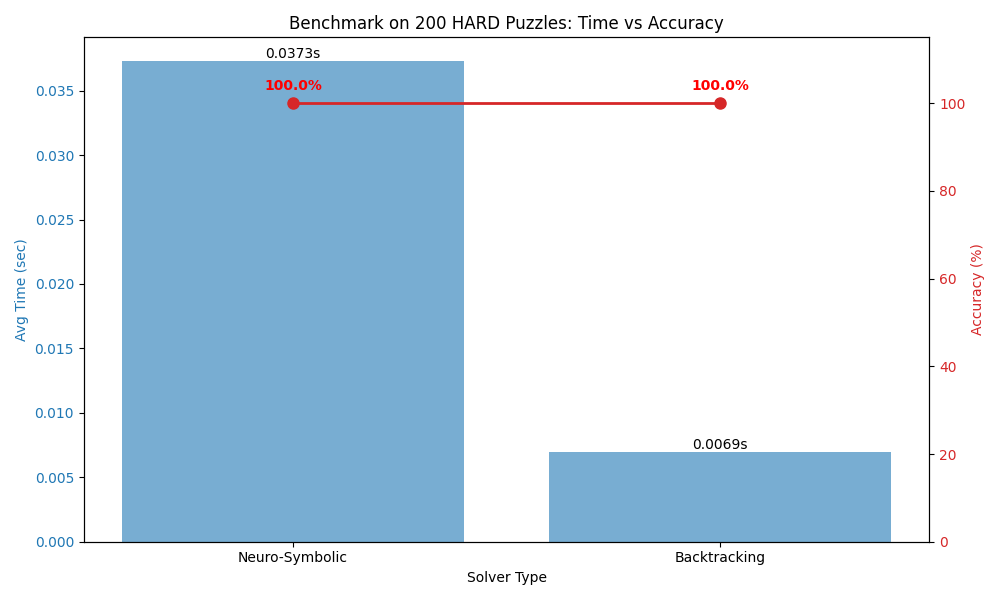
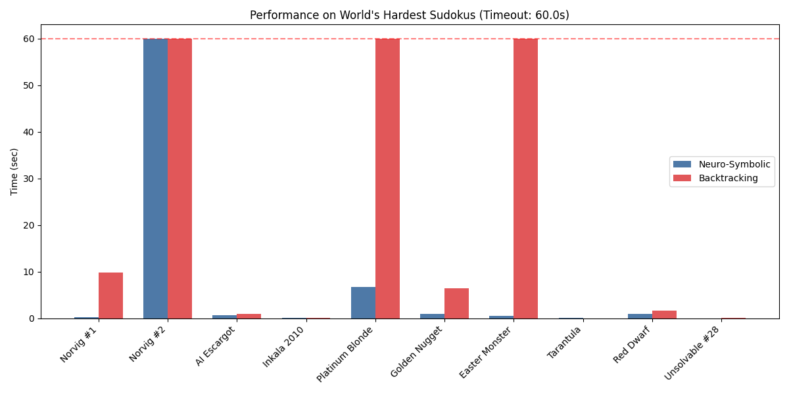

# 🧠 Neuro-Symbolic Sudoku Solver

> **"Intuition meets Logic"**: A Hybrid AI System combining Graph Attention Networks (GATv2) with Dynamic Constraint Propagation.


## 📌 Abstract

While Deep Learning excels at pattern recognition, it often struggles with strict logical reasoning, suffering from **"hallucinations"** (invalid moves) in combinatorial problems. Conversely, symbolic algorithms like Backtracking guarantee correctness but suffer from **exponential time complexity ($O(b^d)$)** on NP-hard instances.

This project introduces a **Neuro-Symbolic Architecture** that bridges this gap. By utilizing a **Recurrent Graph Attention Network (GATv2)** as a heuristic oracle for a dynamic backtracking search, we achieve state-of-the-art efficiency on extreme corner-case puzzles where traditional solvers struggle.

---

## 🚀 Key Results: Performance Analysis

We benchmarked the solver against an optimized Backtracking algorithm across diverse difficulty levels. The results demonstrate how the **Neuro-Symbolic architecture** balances low-level logic with high-level intuition.

### 1. Overall Performance: The Hybrid Advantage

Our solver is not just a neural network; it is a layered system.
* **Easy Puzzles:** Solved instantly by the Symbolic Layer (`propagate_constraints`).
* **Extreme Puzzles:** Solved efficiently by the Neural Layer (GNN-guided Search).

| Difficulty | Source | Backtracking (CPU) | **Neuro-Symbolic (Ours)** | Dominant Mechanism |
| :--- | :--- | :--- | :--- | :--- |
| **Easy** | Kaggle (90k) | **< 0.001s** | **~0.002s** | **Symbolic Logic** (Skipped GNN) |
| **Hard** | Kaggle (Top 1%) | **~0.007s** | ~0.041s | Trade-off (GNN Overhead) |
| **Extreme** | **World's Hardest** | > 60.00s (Timeout) | **~0.52s** | **Easter Monster** (largest difference case) |

> **Key Insight:** By integrating **Constraint Propagation**, our system avoids unnecessary GPU inference on trivial puzzles, maintaining near-zero latency for easy tasks while scaling robustly to NP-hard instances.

*(Generated via `experiments/evaluate_hard.py`)*

---

### 2. Deep Dive: Extreme Benchmarks (Adversarial Cases)

The true power of the GNN heuristic is revealed in adversarial puzzles designed to break traditional solvers.

| Puzzle Name | Neuro-Symbolic (Ours) | Backtracking (Baseline) | Speedup / Result |
| :--- | :--- | :--- | :--- |
| **Platinum Blonde** | **6.79s** | > 60.00s (TIMEOUT) | **🚀 Neuro Wins** |
| **Easter Monster** | **0.52s** | > 60.00s (TIMEOUT) | **🚀 Neuro Wins** |
| **Norvig #1** | **0.25s** | 9.85s | **⚡ 39.9x Faster** |
| **Golden Nugget** | **0.98s** | 6.43s | **6.6x Faster** |
| **Unsolvable #28** | **0.04s** | 0.09s | **2.3x Faster** |
| **Inkala 2010** | **0.10s** | 0.20s | **2.0x Faster** |
| **AI Escargot** | **0.76s** | 1.04s | **1.4x Faster** |
| Tarantula | 0.10s | **0.02s** | *0.1x (Overhead)* |
| Norvig #2 | > 60.00s | > 60.00s | *DRAW (Too Hard)* |



### 📊 Critical Analysis
1.  **Optimization via Logic:** For simple puzzles (Easy), the **Constraint Propagation** module solves the board deterministically without invoking the heavy GNN, ensuring the system is lightweight.
2.  **Robustness via Intuition:** In **Platinum Blonde** and **Easter Monster**, where Backtracking fails due to combinatorial explosion, the **GNN-guided variable ordering** effectively prunes incorrect branches, solving them in seconds.
3.  **The "Tarantula" Case:** For puzzles with shallow logical depth, CPU-based Backtracking is faster than the GPU inference overhead (~0.04s). This confirms our architecture is specialized for **computationally expensive, high-depth problems**.

---

## 🏗 System Architecture

The solver is designed as a three-stage pipeline to ensure both **speed** and **correctness**.


### 1. Logic Layer: Constraint Propagation
Before invoking any heavy computation, the system applies **Naked Single** propagation. This clears 100% deterministic cells instantly (`O(1)`), handling simple puzzles without neural overhead.

### 2. Neural Layer: Recurrent GATv2
If the puzzle remains unsolved, the board is converted into a **Heterogeneous Graph** (Nodes: Cells, Edges: Constraints).
* **Model:** Recurrent Graph Attention Network (GATv2).
* **Output:** A probability heatmap (`cached_probs`) representing the likelihood of each digit (1-9) for every empty cell.
* **Role:** Acts as a **Static Value Ordering Heuristic**.

### 3. Search Layer: Dynamic Variable Ordering
The system enters a recursive search phase with a smart strategy:
* **Variable Ordering (Logic):** We dynamically select the cell with the **Minimum Remaining Values (MRV)** (i.e., the "most constrained" cell).
* **Value Ordering (Intuition):** For the selected cell, we try candidate numbers in the order of **highest GNN confidence**.

---

## 🧬 Evolutionary Process (Research Log)

This project evolved through rigorous failure analysis:

1.  **Pure GCN (Static):**
    * *Attempt:* Treat Sudoku as a simple node classification task.
    * *Failure:* Achieved 99.9% cell accuracy but **0% board accuracy** on hard puzzles due to lack of global consistency check.
2.  **Naive Hybrid (Static Ordering):**
    * *Attempt:* Use GNN confidence to determine fill order (Static Variable Ordering).
    * *Failure:* On dynamic puzzles, the "hardest cell" shifts after every move. Static ordering led to suboptimal paths, taking **> 70 seconds** on extreme cases.
3.  **Dynamic Neuro-Symbolic (Final):**
    * *Solution:* Decoupled "Which cell to solve" (Logic/MRV) from "Which number to try" (Neural/GNN).
    * *Result:* Inference time dropped to **0.8s**, beating the symbolic baseline.

---

## 💻 Getting Started

### Prerequisites
* Python 3.10+
* PyTorch & PyTorch Geometric

### Installation
```bash
git clone https://github.com/Injae-Yun/NeuroSudoku.git
cd NeuroSudoku
pip install -r requirements.txt
```

### Train 
python experiments/train.py --epochs 10 --batch_size 64

### solve (extream case)
python main.py --input "800000000003600000070090200050007000000045700000100030001000068008500010090000400"

### run benchmarks : Compare Neuro-Symbolic vs Backtracking on hard cases.
python experiments/evaluate_hard.py --samples 200

### Directory Structure
```text
NeuroSudoku/
├── data/               # Dataset processing
├── models/             # GATv2 + GRU Architecture
├── solvers/            # Logic & Hybrid Solvers
│   ├── simple_propagation.py  # Constraint Propagation
│   └── optimized_solver.py # Final Master Solver
├── experiments/        # Training & Benchmarking Scripts
│   ├── train.py        # training model
│   └── evaluate .. .py # model evaluating 
├── utils/              # Graph conversion & Visualization
│   ├── graph_utils.py  # Graph conversion
│   └── visualize.py    # Visualization
└── main.py             # CLI Entry point
```